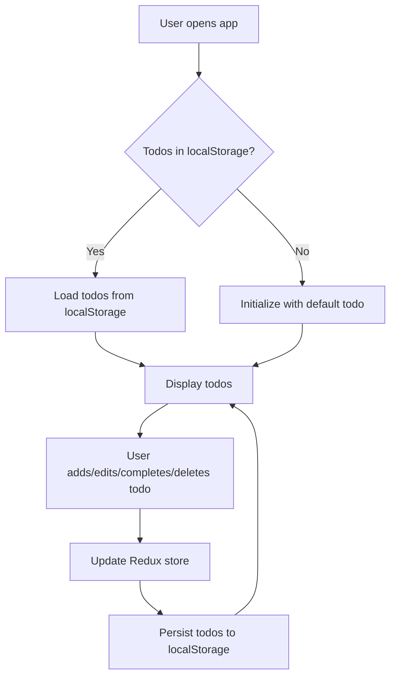

# Business Requirements Document (BRD)

## Project Overview

This document outlines the business requirements for the "Todo List" application built with React, Redux Toolkit, and
Tailwind CSS. The application enables users to manage their daily tasks efficiently.

---

## Objectives

- Allow users to add, edit, complete, and delete todo items.
- Persist todos in local storage for data retention across sessions.
- Provide a responsive and user-friendly interface.

---

## Functional Requirements

### 1. Todo Management

- **Add Todo:** Users can add a new todo by entering text and submitting the form.
- **Edit Todo:** Users can edit the text of an existing todo unless it is marked as completed.
- **Complete Todo:** Users can mark a todo as completed using a checkbox.
- **Delete Todo:** Users can remove a todo from the list.

### 2. State Management

- All todos are managed in a centralized Redux store.
- Actions include: add, remove, update, and toggle completion status.

### 3. Persistence

- Todos are saved to `localStorage` on every change.
- On application load, todos are initialized from `localStorage` if available.

### 4. User Interface

- The UI is styled using Tailwind CSS.
- The application is responsive and accessible.

---

## Non-Functional Requirements

- **Performance:** The app should load quickly and respond instantly to user actions.
- **Reliability:** Data should not be lost between sessions.
- **Maintainability:** Code should be modular and easy to extend.

---

## Application Flow

---

## Suggested Feature Enhancements

1. **Due Dates:** Allow users to set due dates for todos.
2. **Categories/Tags:** Enable categorization or tagging of todos.
3. **Search & Filter:** Add search and filter functionality.
4. **Bulk Actions:** Support bulk completion or deletion.
5. **User Authentication:** Allow users to sign in and sync todos across devices.
6. **Notifications:** Remind users of upcoming or overdue tasks.
7. **Dark Mode:** Provide a toggle for dark/light themes.

---
