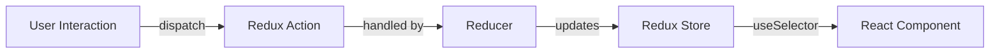
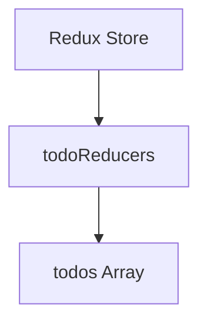
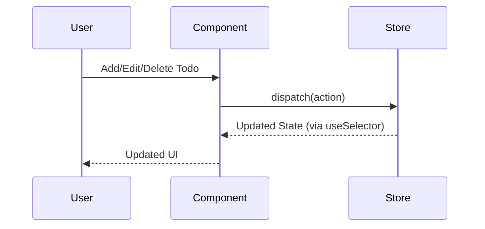

# Technical Documentation: Redux Toolkit in the Todo List App

## Introduction

This document explains how Redux Toolkit is used in this Todo List React application. It covers the concepts of store, reducers, actions, selectors, dispatchers, and how React-Redux connects everything. The goal is to help beginners understand the data flow and architecture.

---

## What is Redux Toolkit?

Redux Toolkit is the official, recommended way to write Redux logic. It simplifies Redux by:

- Reducing boilerplate code.
- Providing utilities to create slices, actions, and reducers.
- Making state management predictable and maintainable.

---

## Core Concepts

### 1. Store

The **store** is a centralized place that holds the entire state of your application.

- Created using `configureStore`.
- Contains all reducers (logic for updating state).

**Example:**

```js
// ...existing code...
import { configureStore } from '@reduxjs/toolkit';
import todoReducer from '../features/todo/todoSlice';

export const store = configureStore({
    reducer: { todoReducers: todoReducer }
});
// ...existing code...
```

---

### 2. Slice, Reducers, and Actions

A **slice** is a collection of Redux reducer logic and actions for a single feature.

- Created using `createSlice`.
- Generates action creators and reducer automatically.

**Example:**

```js
// ...existing code...
import { createSlice, nanoid } from '@reduxjs/toolkit';

const initialState = {
    todos: [{ id: nanoid(), text: 'Learn Redux', completed: false }]
};

export const todoSlice = createSlice({
    name: 'todo',
    initialState,
    reducers: {
        addTodo: (state, action) => {
            state.todos.push({ id: nanoid(), text: action.payload, completed: false });
        },
        removeTodo: (state, action) => {
            state.todos = state.todos.filter(todo => todo.id !== action.payload);
        },
        updateTodo: (state, action) => {
            state.todos = state.todos.map(todo =>
                todo.id === action.payload.id ? { ...todo, text: action.payload.text } : todo
            );
        },
        toggleTodo: (state, action) => {
            state.todos = state.todos.map(todo =>
                todo.id === action.payload ? { ...todo, completed: !todo.completed } : todo
            );
        },
        setTodos: (state, action) => {
            state.todos = action.payload;
        }
    }
});

export const { addTodo, removeTodo, updateTodo, toggleTodo, setTodos } = todoSlice.actions;
export default todoSlice.reducer;
// ...existing code...
```

---

### 3. Provider

The **Provider** component from React-Redux makes the Redux store available to all React components.

**Example:**

```jsx
// ...existing code...
import { Provider } from "react-redux";
import { store } from "./app/store";

createRoot(document.getElementById('root')).render(
  <Provider store={store}>
    <App />
  </Provider>
);
// ...existing code...
```

---

### 4. Selectors

A **selector** is a function that extracts data from the Redux store.

- Use the `useSelector` hook in React components.

**Example:**

```jsx
// ...existing code...
import { useSelector } from 'react-redux';

const todos = useSelector(state => state.todoReducers.todos);
// ...existing code...
```

---

### 5. Dispatching Actions

To change state, components **dispatch actions** using the `useDispatch` hook.

**Example:**

```jsx
// ...existing code...
import { useDispatch } from 'react-redux';
import { addTodo } from "../features/todo/todoSlice.js";

const dispatch = useDispatch();
dispatch(addTodo(todoMessage));
// ...existing code...
```

---

## How Data Flows

1. **User interacts** with a component (e.g., adds a todo).
2. **Component dispatches** an action (e.g., `addTodo`).
3. **Reducer updates** the state in the store.
4. **Components re-render** with the new state via `useSelector`.

---

## Diagrams

### 1. Redux Data Flow



---

### 2. Store Structure



---

### 3. Component-Store Interaction



---

## Summary

- **Redux Toolkit** simplifies Redux by generating actions and reducers.
- The **store** holds the app state; **Provider** makes it available to components.
- **Reducers** define how state changes in response to actions.
- **Selectors** read data from the store.
- **Dispatch** sends actions to update state.
- React components use **useSelector** and **useDispatch** to interact with Redux.

This architecture keeps your state predictable, centralized, and easy to debug, making your React app scalable and maintainable.

---